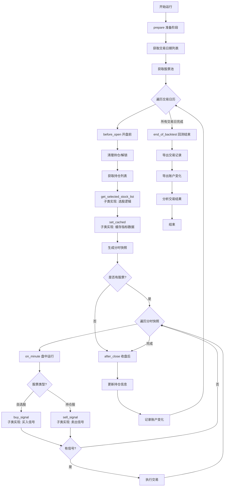

## MoneyDog 量化交易系统

MoneyDog(旺财) 是一个基于 **Python + 本地 DuckDB 数据库** 的量化交易回测小系统，采用策略基类架构，支持灵活的策略开发与配置。

### 🚀 功能特性

- **策略基类架构**: 提供 `BaseStrategy` 基类，简化策略开发流程
- **策略可配置**: 通过配置文件切换策略，无需修改代码
- **策略回测**: 按交易日逐日回放，支持分钟级分时回测
- **技术分析**: 内置多种 K 线、均线、量能、MACD 等技术指标与图形识别算法
- **模拟交易**: 支持资金管理、持仓管理、佣金与印花税精细计算
- **数据管理**: 使用 DuckDB 本地库 (`data/stock.duckdb`) 存储日线与分钟线行情
- **结果分析**: 自动导出交易记录、账户曲线与分析结果 Excel
- **日志系统**: 全量记录回测过程，便于诊断与调优

---

## 📁 项目结构（当前版本）

```text
MoneyDog/
├── main.py                # 主程序入口，运行回测
├── config.ini             # 实际配置文件
├── config.example.ini     # 配置文件示例
├── requirements.txt       # 依赖包列表
├── data/
│   └── stock.duckdb       # 行情数据 DuckDB 库（需预先准备）
├── strategys/             # 策略模块
│   ├── BaseStrategy.py    # 策略基类，提供通用框架
│   └── *.py               # 具体策略实现
├── utils/                 # 工具与基础设施模块
│   ├── broker.py          # 模拟交易撮合与资金管理
│   ├── data.py            # 从 DuckDB 读取行情、交易日历等
│   ├── duckdb.py          # DuckDB 连接与封装
│   ├── logger.py          # 日志系统封装
│   └── util.py            # 通用工具函数（时间转换、快照生成等）
├── laboratory/            # 实验室：技术指标与图形识别
│   ├── analyze.py         # 交易与账户数据分析、生成统计报表
│   ├── custom.py          # 自定义图形识别逻辑
│   ├── singleK.py         # 单 K 线形态分析
│   └── multipleK.py       # 多 K 线、量价配合分析
├── test/                  # 单元测试
├── logs/                  # 运行日志（按日期滚动）
└── results/               # 回测输出结果（Excel）
```

> 说明：历史版本中曾依赖 QMT / XTQuant，目前代码以本地 DuckDB + AKShare 为主，相关 QMT/XTQuant 目录已移除。

---

## 🛠️ 安装与环境

### 环境要求

- **Python** ≥ 3.8
- 推荐在 **Windows** 环境下运行（日志、路径等默认按 Windows 习惯编写）

### 安装步骤

1. **克隆项目**

   ```bash
   git clone <repository-url>
   cd MoneyDog
   ```

2. **创建虚拟环境（推荐）**

   ```bash
   python -m venv venv
   venv\Scripts\activate  # Windows
   # 或 source venv/bin/activate  # macOS / Linux
   ```

3. **安装依赖**

   ```bash
   pip install -r requirements.txt
   ```

4. **准备配置文件**

   Windows：

   ```bash
   copy config.example.ini config.ini
   notepad config.ini
   ```

   macOS / Linux：

   ```bash
   cp config.example.ini config.ini
   nano config.ini  # 或任意编辑器
   ```

5. **准备 DuckDB 数据库**

- 在 `config.ini` 中指定 DuckDB 路径（默认 `data/stock.duckdb`）
- 通过自有脚本将日线与 1 分钟线行情写入对应表（如 `stock_list`、`daily_1day`、`daily_1min`）

当前代码假定 DuckDB 中至少存在：

- `stock_list`：包含 `code` 字段，用于构建主板股票池
- `daily_1day`：日线行情，包含 `code, time, open, high, low, close, volume, amount`
- `daily_1min`：1 分钟行情，字段同上

---

## ⚙️ 配置说明（config.ini 当前字段）

### 日志与数据

```ini
[LOGGING]
# 日志级别: DEBUG, INFO, WARNING, ERROR, CRITICAL
level = INFO

[DATA]
# DuckDB 行情数据库路径
data_path = data/stock.duckdb
```

### 策略配置

```ini
[STRATEGY]
# 策略模块名（策略文件名，不含.py后缀）
strategy_module = N_Pattern_Bottom
# 策略类名（策略类名称）
strategy_class = NPatternBottom
```

> 通过修改 `[STRATEGY]` 配置段即可切换不同策略，无需修改代码。

### 回测参数

```ini
[BACKTEST]
# 回测开始/结束时间（数字日期）
backtest_start_time = 20250901
backtest_end_time   = 20250930

# 初始资金
initial_amount = 1000000

# 手续费率（双向收取）
commission_rate = 0.0001
# 最低佣金（双向收取）
min_commission = 5
# 印花税（卖出收取）
tax_rate = 0.0005

# 单股仓位控制方式: 'ratio' 按总资产比例 / 'amount' 按固定金额
limit_vol_type = amount
# 当 limit_vol_type = ratio 时生效（如 0.05 表示单股不超过总资产 5%）
max_vol_rate = 0.05
# 当 limit_vol_type = amount 时生效（如 100000 表示单股最多 10 万）
max_vol_amount = 100000
```

---

## 🚀 快速开始

### 运行回测

1. **配置策略**

   在 `config.ini` 的 `[STRATEGY]` 段中配置要使用的策略：

   ```ini
   [STRATEGY]
   strategy_module = N_Pattern_Bottom
   strategy_class = NPatternBottom
   ```

2. **运行回测**

   确保 `config.ini` 与 `data/stock.duckdb` 准备妥当后，在项目根目录执行：

   ```bash
   python main.py
   ```

   系统会自动根据配置文件加载对应策略并开始回测。

   日志会输出到控制台及 `logs/MoneyDog_YYYY-MM-DD.log`。

### 查看结果

回测完成后，`results/` 目录下会生成若干 Excel 文件，例如：

- `original_transactions_YYYYMMDD_HHMMSS.xlsx`：原始逐笔交易与持仓变动
- `position_and_account_changes_YYYYMMDD_HHMMSS.xlsx`：每日账户与持仓统计
- `analyze_transactions_YYYYMMDD_HHMMSS.xlsx`：交易统计分析结果（由 `laboratory/analyze.py` 生成）

---

## 📊 典型分析指标

分析模块会基于交易记录与账户曲线，计算并输出（具体以代码实现为准）：

- **资金与收益**: 初始资金、期末总资产、总收益率
- **交易统计**: 交易次数、完成闭环股票数量、胜率、平均盈利率与亏损率
- **仓位与风险**: 每日持仓数量、最大持仓数、账户资产曲线及最大回撤

（如需更多因子/图表，可在 `laboratory/analyze.py` 中自行扩展。）

---

## 🔧 开发与扩展指南

### 策略基类运行流程

`BaseStrategy` 基类提供了完整的回测框架，运行流程如下：



#### 流程说明

**准备阶段（prepare）**
- 获取交易日期列表：根据配置的回测时间区间生成交易日历
- 获取股票池：默认使用主板股票池，子类可重写 `_get_stock_list()` 方法

**每日运行循环**
- **开盘前（before_open）**：
  - 清理持仓：清除 volume 为 0 的持仓，解锁昨日被锁定的持仓
  - 获取持仓列表：当前持有的股票（预卖出）
  - 获取自选列表：调用子类的 `get_selected_stock_list()` 方法筛选股票（预买入）
  - 缓存数据：调用子类的 `set_cached()` 方法计算并缓存技术指标
  - 生成分时快照：为当日回测准备分钟级行情数据

- **盘中运行（on_minute）**：
  - 遍历每分钟的快照数据
  - 对于自选股：调用子类的 `buy_signal()` 方法判断买入信号
  - 对于持仓股：调用子类的 `sell_signal()` 方法判断卖出信号
  - 如有信号，执行交易（买入/卖出）

- **收盘后（after_close）**：
  - 更新持仓信息：使用最后一个分时快照更新持仓最新价
  - 记录账户变化：记录当日账户与持仓变化

**回测结束（end_of_backtest）**
- 导出交易记录和账户变化数据到 Excel
- 调用分析模块对交易结果进行统计分析

> **注意**：标有"子类实现"的方法需要由策略开发者实现，其他流程由基类自动处理。

### 基于策略基类开发新策略

推荐使用策略基类 `BaseStrategy` 开发新策略，可以大幅简化开发流程。

#### 步骤1：创建策略文件

在 `strategys/` 目录下创建新的策略文件，例如 `MyStrategy.py`：

```python
from strategys.BaseStrategy import BaseStrategy
from typing import List, Dict, Optional
import pandas as pd

class MyStrategy(BaseStrategy):
    """
    我的策略
    """
    
    def __init__(self):
        """
        初始化策略
        """
        super().__init__()
        # 添加策略特定参数
        self.price_min = 5.0
        self.price_max = 60.0
    
    def get_selected_stock_list(self, trade_date: str) -> List[str]:
        """
        获取自选股票列表（预买入）
        子类必须实现此方法
        """
        # 实现选股逻辑
        pass
    
    def set_cached(self, trade_date: str) -> bool:
        """
        缓存盘前数据（备用于盘中运行）
        子类必须实现此方法
        """
        # 实现数据缓存逻辑
        pass
    
    def buy_signal(self, stock_code: str, bars: pd.DataFrame) -> Optional[Dict]:
        """
        买入信号生成
        子类必须实现此方法
        """
        # 实现买入信号逻辑
        pass
    
    def sell_signal(self, stock_code: str, bars: pd.DataFrame) -> Optional[Dict]:
        """
        卖出信号生成
        子类必须实现此方法
        """
        # 实现卖出信号逻辑
        pass
```

#### 步骤2：实现四个核心方法

策略基类要求实现以下四个抽象方法：

1. **`get_selected_stock_list(trade_date)`**：获取自选股票列表（预买入）
   - 根据选股条件筛选股票
   - 返回股票代码列表

2. **`set_cached(trade_date)`**：缓存盘前数据
   - 计算并缓存技术指标
   - 存储到 `self.cached[stock_code]` 字典中

3. **`buy_signal(stock_code, bars)`**：买入信号生成
   - 根据分时K线数据判断买入条件
   - 返回交易信号字典或 `None`

4. **`sell_signal(stock_code, bars)`**：卖出信号生成
   - 根据分时K线数据判断卖出条件
   - 返回交易信号字典或 `None`

#### 步骤3：配置策略

在 `config.ini` 中添加策略配置：

```ini
[STRATEGY]
strategy_module = MyStrategy
strategy_class = MyStrategy
```

#### 步骤4：运行回测

直接运行 `main.py`，系统会自动加载配置的策略：

```bash
python main.py
```

#### 基类提供的功能

`BaseStrategy` 基类已经实现了以下功能，无需重复开发：

- ✅ 策略运行主流程（`run()`）
- ✅ 交易日历获取与遍历
- ✅ 股票池管理
- ✅ 开盘前/收盘后处理
- ✅ 分时快照生成与遍历
- ✅ 持仓管理
- ✅ 交易执行
- ✅ 回测结果导出与分析

#### 参考示例

可以参考 `strategys/` 目录下的现有策略实现了解完整的开发示例。

### 扩展技术指标与形态识别

- 在 `laboratory/singleK.py` 中扩展单 K 线形态
- 在 `laboratory/multipleK.py` 中扩展多 K 线、均线、量能等组合信号
- 在 `laboratory/custom.py` 中实现更复杂的图形或板块级逻辑

### 扩展数据接口

- `utils/data.py` 中目前主要通过 DuckDB 读取已经准备好的行情数据
- 可以：
  - 增加从 AKShare 直接获取数据并写入 DuckDB 的辅助函数
  - 接入其他数据源（如本地 CSV/Parquet 或第三方行情接口），统一写入 DuckDB

---

## 📝 日志系统

日志由 `utils/logger.py` 统一管理：

- **日志级别**: DEBUG / INFO / WARNING / ERROR / CRITICAL（由 `[LOGGING]` 段配置）
- **输出位置**: 控制台 + `logs/MoneyDog_YYYY-MM-DD.log`
- **内容**: 时间戳、级别、模块名、具体消息（含策略运行进度与关键信号）

---

## 🧪 测试

项目自带若干基础测试，可用于验证数据接口与关键工具函数：

```bash
# 运行所有测试
python -m pytest test/

# 运行特定测试
python test/test_data.py
python test/test_multipleK.py
python test/test_util.py
python test/test_logger.py
```

---

## 🤝 贡献说明

1. Fork 本仓库
2. 创建特性分支：`git checkout -b feature/MyFeature`
3. 提交改动：`git commit -m "feat: add MyFeature"`
4. 推送到远程：`git push origin feature/MyFeature`
5. 提交 Pull Request 并简要说明改动内容与使用方式

---

## ⚠️ 免责声明

本项目仅供个人学习与研究使用，不构成任何投资建议。  
如将本系统用于实盘或仿真交易，由此产生的任何收益或损失由使用者自行承担，请务必独立判断、谨慎决策。
